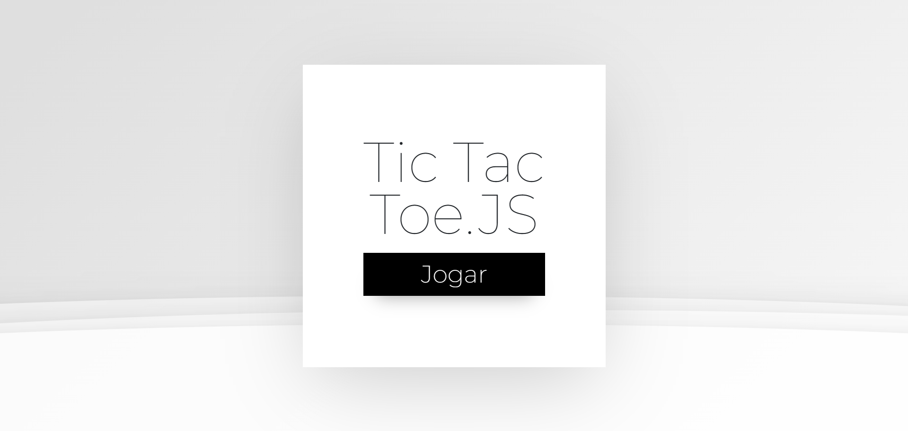
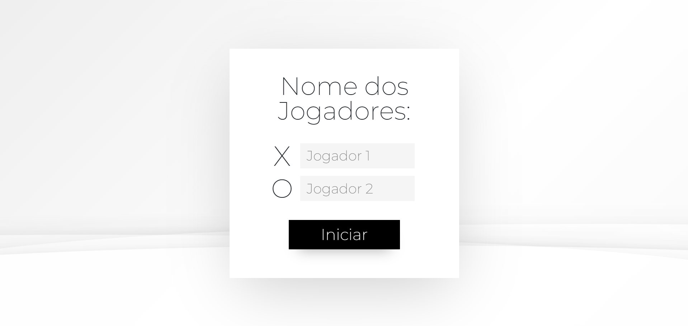
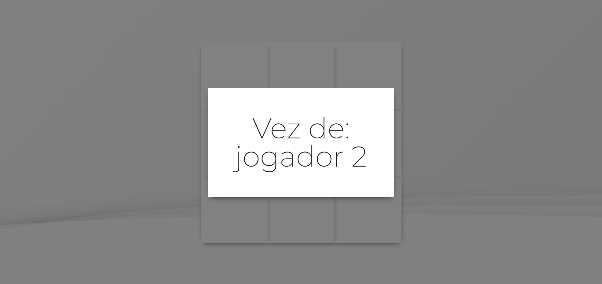
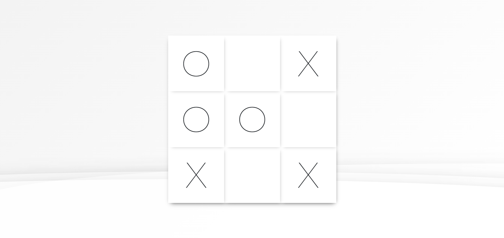

# Tic-Tac-Toe.JS

## Sobre o projeto

O projeto em questão se trata de um jogo da velha (tic-tac-toe), desenvolvido com o objetivo de botar em prática minhas habilidades com o desenvolvimentos Front-End e conceitos importantes na lógica de programação. 

É possível acessar a página a partir do botão a seguir.

## Layout

## Tecnologias utilizadas

### Front-End

### Ferramentas Externas

◾️ micku7zu.github.io/vanilla-tilt.js

## Autor

◾️ Maicon de Oliveira da Silva

